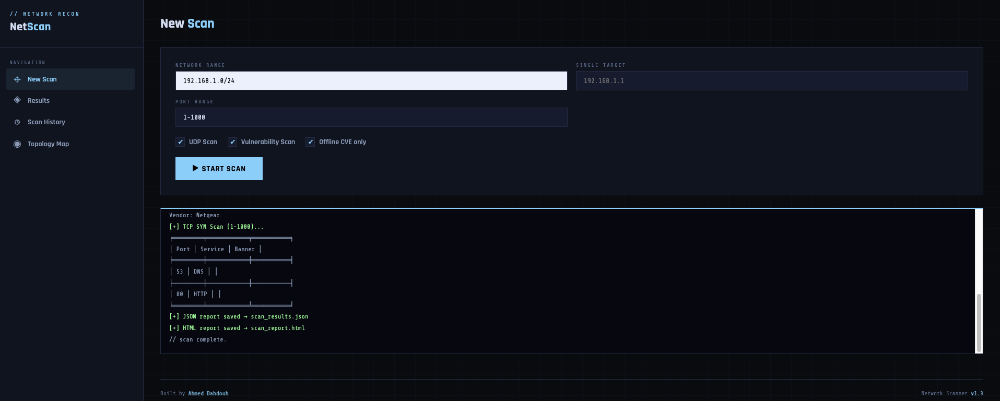

# 🔎 Network Scanner


A **multi-threaded network scanner** built in Python with SYN scanning, UDP scanning, OS detection, MAC vendor lookup, service detection, vulnerability scanning, and a full web dashboard with live scan streaming.

This project mimics core functionality of professional tools like Nmap while being implemented from scratch for learning purposes.



---

## 🚀 Features

| Feature | Status |
|---|---|
| Host Discovery (ARP + ICMP fallback) | ✅ |
| Auto Network Interface Detection | ✅ |
| TCP SYN Scan | ✅ |
| UDP Scan | ✅ |
| OS Fingerprinting (TTL-based) | ✅ |
| Service Detection + Banner Grabbing | ✅ |
| MAC Vendor Lookup (offline) | ✅ |
| Randomized MAC Detection | ✅ |
| Vulnerability Scan (CVE lookup) | ✅ |
| mDNS Device Identification | ✅ |
| Multi-threading | ✅ |
| JSON Reports | ✅ |
| HTML Reports | ✅ |
| Web Dashboard (Flask) | ✅ |
| Live Scan Streaming | ✅ |
| Scan History | ✅ |
| Dark / Light Theme | ✅ |
---

## 📸 Example Output

```
###########################################
#        NETWORK SCANNER v1.3            #
#        Author: Ahmed Dahdouh           #
###########################################

[+] Discovering hosts in 192.168.1.0/24
[+] Detected active interface: en0 (192.168.1.13)
[+] Running ARP Scan on interface en0...
[+] ARP scan found 3 host(s).
[+] mDNS probe (8s) — listening for device announcements...

─────────────────────────────────────────────
Scanning host: 192.168.1.1  [68:9a:21:2e:6a:a0]
─────────────────────────────────────────────
  OS:       Linux / macOS
  Device:   Router / AP
  Vendor:   Netgear

[+] TCP SYN Scan (1-1000)...
╒════════╤═══════════╤══════════╕
│   Port │ Service   │ Banner   │
╞════════╪═══════════╪══════════╡
│     53 │ DNS       │          │
├────────┼───────────┼──────────┤
│     80 │ HTTP      │          │
╘════════╧═══════════╧══════════╛

[+] Vulnerability scan — checking 2 port(s)...
    192.168.1.1:53 (DNS)  → 3 CVE(s), worst: CRITICAL
    192.168.1.1:80 (HTTP) → 3 CVE(s), worst: CRITICAL

[+] JSON report saved → scan_results.json
[+] HTML report saved → scan_report.html
```

---

## 📦 Requirements

- Python 3.8+
- Scapy
- Tabulate
- Colorama
- Manuf
- Flask

---

## ⚙️ Installation

Clone the repository:

```bash
git clone https://github.com/AhmedDAH1/network-scanner.git
cd network-scanner
```

Install dependencies:

```bash
pip install -r requirements.txt
```

> **Note:** SYN scanning and ARP host discovery require root privileges. Always run with `sudo`.

---

## 🌐 Web Dashboard

Start the web interface:

```bash
sudo python3 web_app.py
```

Then open **http://localhost:5000** in your browser.

The dashboard lets you:
- Run scans directly from the browser with a form UI
- Watch live terminal output stream in real time as the scan runs
- View results with expandable host cards, port tables, and CVE listings
- Browse scan history — every scan is saved and reloadable
- Toggle between dark and light themes

---

## 🧠 CLI Usage

### Scan an entire network
```bash
sudo python3 test.py -n 192.168.1.0/24
```

### Scan a single host
```bash
sudo python3 test.py -t 192.168.1.1
```

### Scan a custom port range
```bash
sudo python3 test.py -t 192.168.1.1 -p 1-65535
```

### Enable UDP scan
```bash
sudo python3 test.py -t 192.168.1.1 --udp
```

### Enable vulnerability scan (NVD API)
```bash
sudo python3 test.py -n 192.168.1.0/24 --vuln
```

### Vulnerability scan offline only
```bash
sudo python3 test.py -n 192.168.1.0/24 --vuln --no-api
```

### Combine all options
```bash
sudo python3 test.py -n 192.168.1.0/24 -p 1-500 --udp --vuln
```

---

## ⚙️ Command Line Options

| Option | Description |
|---|---|
| `-n` | Scan a network range (e.g. `192.168.1.0/24`) |
| `-t` | Scan a single host |
| `-p` | Port range (default: `1-1000`) |
| `--udp` | Enable UDP scan on common ports |
| `--vuln` | Enable CVE vulnerability scan (uses NVD API) |
| `--no-api` | Use offline CVE table only (no internet needed) |
| `-h` | Show help menu |

---

## 📁 Project Structure

```
network-scanner/
│
├── test.py                  # CLI entry point
├── web_app.py               # Flask web dashboard
├── report_template.html     # HTML report template
├── requirements.txt         # Python dependencies
├── scan_results.json        # Generated JSON report
├── scan_report.html         # Generated HTML report
├── scan_history.json        # Web dashboard scan history
│
└── scanner/
    ├── __init__.py
    ├── host_discovery.py    # ARP + ICMP host discovery, interface detection
    ├── syn_scan.py          # TCP SYN scanning (multi-threaded)
    ├── udp_scan.py          # UDP scanning (multi-threaded)
    ├── service_detection.py # Port-to-service mapping + banner grabbing
    ├── os_fingerprint.py    # TTL-based OS fingerprinting
    ├── device_detection.py  # MAC vendor lookup + device classification
    ├── mdns_probe.py        # mDNS/Bonjour device identification
    ├── vuln_scan.py         # CVE lookup via NVD API + offline table
    └── port_scanner.py      # TCP connect scan (fallback)
```

---

## 📄 JSON Output Example

```json
[
  {
    "host": "192.168.1.1",
    "mac": "68:9a:21:2e:6a:a0",
    "vendor": "Netgear",
    "os": "Linux / macOS",
    "device": "Router / AP",
    "tcp_ports": [
      {
        "port": 53,
        "service": "DNS",
        "banner": null,
        "cves": [
          { "id": "CVE-2020-1350", "severity": "CRITICAL", "desc": "Windows DNS Server RCE (SIGRed)" }
        ]
      }
    ],
    "udp_ports": []
  }
]
```

---

## 🛠️ How It Works

**Host Discovery** — Sends ARP requests on the active network interface to find live hosts. Automatically detects the correct interface (skipping VPN tunnels). Falls back to ICMP ping if ARP fails.

**TCP SYN Scan** — Crafts raw SYN packets with Scapy and checks for SYN-ACK responses to identify open ports without completing the handshake. Runs with 100 concurrent threads.

**UDP Scan** — Sends UDP packets to common ports and interprets ICMP unreachable responses to determine closed vs. open/filtered status.

**OS Fingerprinting** — Analyses the TTL value in ICMP responses. TTL ≤ 64 → Linux/macOS, TTL ≤ 128 → Windows.

**MAC Vendor Lookup** — Uses a curated OUI table combined with the offline `manuf` library to identify device manufacturers without any internet dependency. Detects randomized/privacy MACs automatically.

**Service Detection** — Maps open ports to known service names and attempts banner grabbing to identify the exact software running.

**Vulnerability Scan** — Queries the NIST NVD API for CVEs matching each detected service. Falls back to a curated offline table covering FTP, SSH, HTTP, DNS, RDP, SMB, MySQL and more when offline. CVEs are rated CRITICAL / HIGH / MEDIUM / LOW using CVSS scores.

**Web Dashboard** — Flask server with Server-Sent Events (SSE) for real-time scan output streaming. Scan history is persisted locally as JSON.

---

## 🔮 Future Improvements

- CSV export
- Improved OS fingerprinting (TCP stack analysis)
- Version-aware CVE matching via banner grabbing
- IPv6 support

---

## 📌 Changelog

**v1.3**
- Added Flask web dashboard
- Live scan output streaming via Server-Sent Events
- Scan history with reloadable results
- Dark / light theme toggle
- Results page with expandable host cards and CVE listings

**v1.2**
- Added vulnerability scan (CVE lookup via NVD API + offline table)
- Added `--vuln` and `--no-api` CLI flags
- CVEs displayed per port in terminal and HTML report with severity color-coding
- Added mDNS/Bonjour device identification module

**v1.1**
- Added UDP scanning
- Added MAC vendor lookup (offline, via manuf + curated OUI table)
- Added randomized MAC detection
- Fixed ARP scan on macOS (VPN-aware interface detection)
- Improved HTML report (dark theme, TCP + UDP tables, vendor/MAC info)
- Fixed service detection signature (ip, port)
- Fixed SYN scan function naming consistency
- Added colorized CLI output

**v1.0**
- Initial release
- Host discovery (ARP + ICMP)
- TCP SYN scanning
- OS fingerprinting
- Service detection
- HTML + JSON reporting

---

## 👨‍💻 Author

**Ahmed Dahdouh** — [GitHub](https://github.com/AhmedDAH1) · [LinkedIn](https://www.linkedin.com/in/ahmed-dahdouh)
---

## ⚠️ Disclaimer

This tool is intended for **educational purposes only**.
Only scan networks you own or have explicit permission to test.
Unauthorized network scanning may be illegal in your jurisdiction.

---

## 📜 License

MIT License
